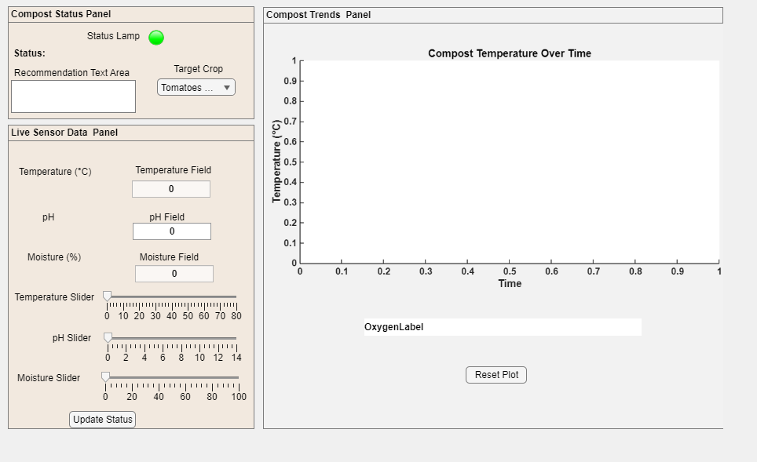

# SmartCompost — Project Showcase

**A MATLAB App Designer prototype exploring compost conditions and simulated glyphosate degradation.**

SmartCompost is an ongoing team project supported by a **VentureWell E-Team grant**. It explores how scientific computing and experimental work can support the interpretation of compost conditions.

This repository presents the project for portfolio review. The development application, source code, model parameters, and experimental methods are maintained privately.

## SmartCompost Demo

**[Watch the SmartCompost demo (4 seconds, silent)](docs/SmartCompost_Demo.mp4)**

A brief recording showing changing inputs and the temperature and simulated glyphosate-degradation plots. If GitHub does not play the video inline, use **View raw** or **Download** on the video page.

## Current Prototype

*Saved interface preview of the current app before a simulation is run. See the demo above for populated plots.*

The application currently supports:

- Interactive temperature, moisture, and pH controls.
- Simulation updates that show how selected conditions affect modeled degradation.
- A dual-axis plot displaying temperature and simulated glyphosate concentration.
- Crop-category selection and condition-based feedback.
- Simulation history and plot reset controls.

**Research status:** Inputs are currently manual and concentrations are simulated. The interface's “Live Sensor Data” title does not indicate an implemented hardware connection. Crop-related feedback is illustrative and does not establish compost safety. Experimental validation and physical sensor integration are development goals.

## Team and Contributions

| Team member | Role | Contribution |
| --- | --- | --- |
| [Ernest Pae](https://github.com/ernestpae) | Computational Lead | MATLAB application development, computational modeling, interactive controls, and data visualization |
| Romeo Adu Appiah | Experimental Lead | Oversees the experimental part of SmartCompost |

The project combines computational development with experimental work. These role descriptions credit contributions; they do not specify legal ownership of project IP.

## Technical Focus

Ernest's computational work brings together:

- **MATLAB App Designer:** event-driven callbacks and user interface components.
- **Numerical modeling:** updating a simulated state as input conditions change.
- **Scientific visualization:** presenting two quantities with different units on coordinated axes.
- **Application state management:** retaining simulation history and supporting reset behavior.

## Earlier Prototype

SmartCompost evolved from the Sensor Data Dashboard, which gives this repository its original name.

[Watch the earlier 31-second sensor-dashboard demo](docs/Sensor_dashboard_demo.mp4)

This video shows the **earlier prototype**, not the current SmartCompost features. The current SmartCompost demo is linked above.

## Development Direction

Ongoing work includes model validation, physical sensor integration, and interface refinement. The public showcase provides an overview of the work without publishing the development implementation.
