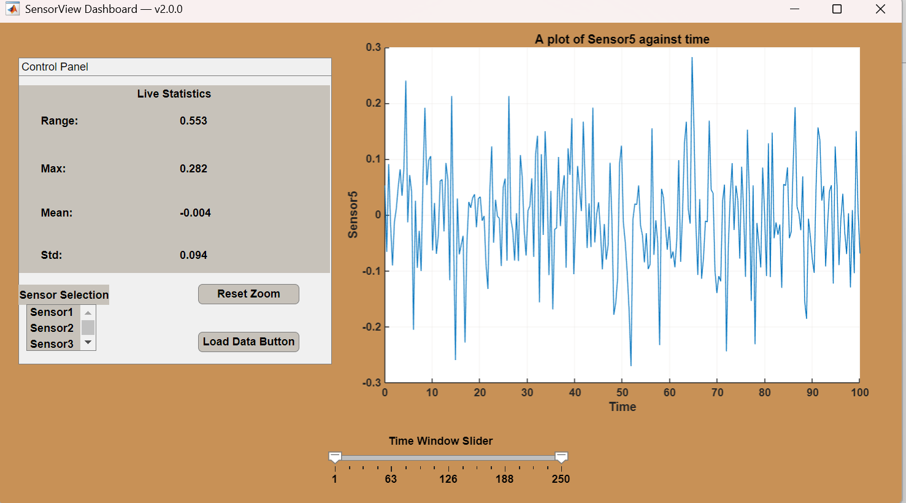

# Sensor Data Dashboard Demo

An early MATLAB App Designer prototype for interactive sensor-data visualization.

## Background

This project was an early software prototype that contributed to the development of SmartCompost, a student venture focused on using sensor measurements and chemistry-informed analysis to assess compost conditions.

## Purpose

The prototype was designed to explore:

- Interactive visualization of sensor measurements
- Temperature and moisture monitoring
- Condition-based feedback
- MATLAB App Designer for scientific user interfaces

## Current Status

This repository represents an early prototype rather than the current SmartCompost system. The project has since evolved toward integrating physical sensors and Arduino-based data collection.

## Tools

- MATLAB
- MATLAB App Designer

# SensorDataDashboard-Demo
Demo showcase of my MATLAB app for interactive sensor-data visualization.

## Demo

### Screenshot

### 31-Second Demo Video
[Watch the demo](docs/Sensor_dashboard_demo.mp4)
